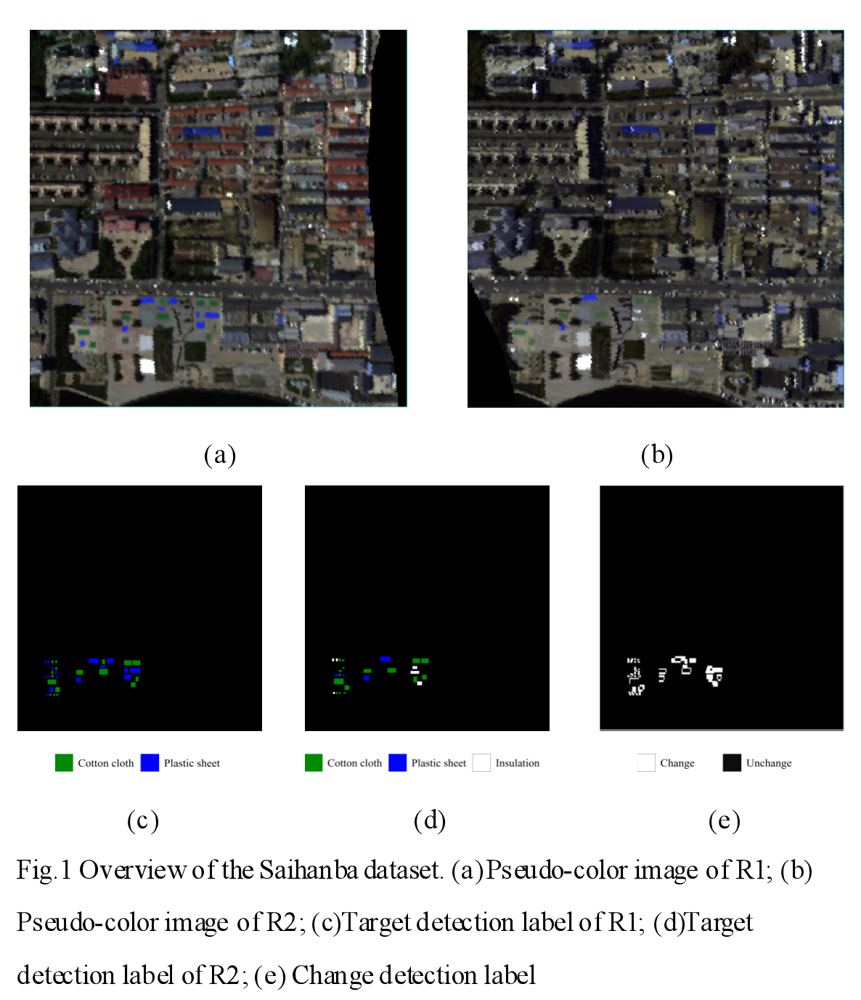

# Saihanba: A Multi-Task Hyperspectral Target and Change Detection Dataset

## Overview

Saihanba is a multi-temporal hyperspectral dataset designed for both **hyperspectral target detection (HTD)** and **hyperspectral change detection (HCD)**. The dataset provides pixel-level annotations for target detection in each temporal image and pixel-level annotations for change detection between bi-temporal image pairs, enabling unified evaluation of both tasks.

<p align="center">
  
</p>

## Dataset

The dataset includes:

- Multi-temporal hyperspectral images
- Pixel-level target detection annotations
- Pixel-level change detection annotations

### Directory Structure

```text
Saihanba: 
├── Images/
│   ├── img1/
│   └── img2/
├── Target_GT/
│   ├── GT_img1/
│   └── GT_img2/
├──Change_GT/
│   ├──  binary_GT/
└── README.md
```

## Download

The dataset is available at:

- Google Drive: *Coming Soon*
- Baidu Netdisk: *Coming Soon*

## Citation

If you find this dataset useful for your research, please consider citing:

```bibtex
@article{Saihanba,
  title={Saihanba: A Multi-Task Hyperspectral Target and Change Detection Dataset},
  author={Yao Jin, Huisi Zhang, Kaixuan Jiang, Weijie Hong, Dehui Zhu, Meiqi Hu, Chen Wu, Anmin Fu, Tianjie Zhao},
  journal={},
  year={2026}
}
```

## License

This dataset is released for **academic research only**. Commercial use is prohibited without permission from the authors.

## Contact

If you have any questions, please feel free to contact us.

**Yao Jin**  
📧 jy13476021522@163.com

**Chen Wu**  
📧 chen.wu@whu.edu.cn
📧 jy13476021522@163.com
📧 chen.wu@whu.edu.cn
